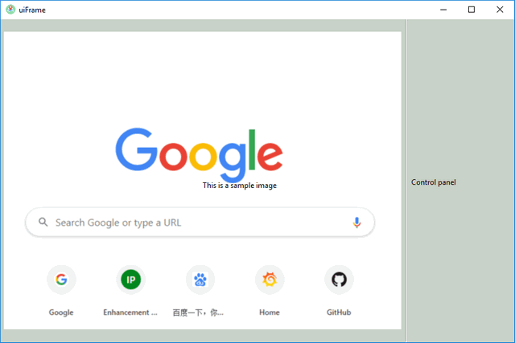

# ProgramTools - [wxUIFrame] 
#### Introduction

This project is a sub-project of the programTools, we will create a simple wxpython application frame work which will be used for other project. The application has these function: 

- Periodic call back function to do some regular work. (such as frequently update the display image in a panel or send message to other application)
- Provide sizer to set the whole application UI layout.
- Provide a parallel thread to handle the incoming/outgoing data communication.(UDP/TCP)
- Provide different kinds of wxPanels to handle user's different request.(image display/Control)

###### Simple Application UI



------

#### Program Setup

###### Development Environment : python2.7 ~ python 3.7

###### Additional Lib/Software Need :

wxPython 4.0.6 (build UI this lib need to be installed) 

```
pip install -U wxPython 
```

###### Hardware Needed : None

###### Program File List :

| Program File | Execution Env | Description                                                  |
| :----------- | ------------- | ------------------------------------------------------------ |
| uiGlobal.py  | python2.7/3   | This module is used as a local config file to set constants, global parameters which will be used in the other modules. |
| uiPanel.py   | python2.7/3   | This module is used to create different function panels.     |
| uiRun.py     | python2.7/3   | This module is used to create the main wx frame.             |

------

#### Program Usage

###### Program execution cmd: 

```
python uiRun.py
```

------

> Last edit by LiuYuancheng(liu_yuan_cheng@hotmail.com) at 13/01/2020